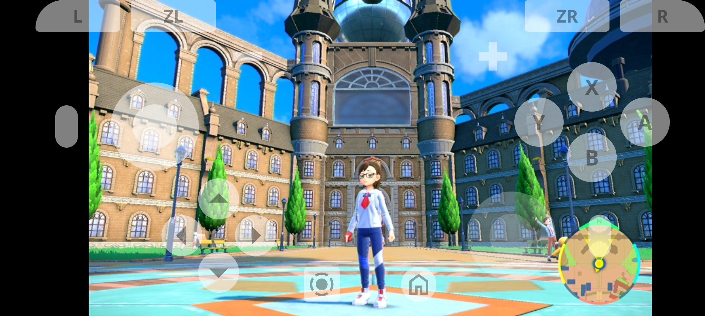

# remote-game-console

Web-based remote control system for video, audio, and game controller streaming.

## Features

- Video streaming: MJPEG format over HTTP
- Audio streaming: Real-time PCM audio over WebSocket
- Game controller: JSON over WebSocket, serial port communication for [NX Macro Controller](https://blog.bzl-web.com/entry/2020/01/20/165719) compatible devices



## Requirements

### System Dependencies

- Node.js
- FFmpeg (or specify the binary path in the config file)

## Installation

```bash
$ npm install
$ npm run build
$ npm run serve -- $PWD/server.config.json5
```

## Configuration

### Server Configurations

Configure server settings using JSON5 format. See [server.config.json5](server.config.json5) for an example.

### URL Parameters

The frontend supports several URL parameters for customization:

- `?audioTargetLatency=100` - Target audio latency in milliseconds
- `?audioMaxLatency=250` - Maximum acceptable audio latency
- `?videoAspectRatioWidth=16&videoAspectRatioHeight=9` - Override video aspect ratio

## Fullscreen Display on iOS

Due to very limited [Fullscreen API](https://developer.mozilla.org/en-US/docs/Web/API/Element/requestFullscreen) support, there is currently no practical method to achieve fullscreen mode on iOS devices.

## Acknowledgments

- [yoannmoinet/nipplejs](https://github.com/yoannmoinet/nipplejs) by Yoann Moinet ([MIT license](node_modules/nipplejs/LICENSE))
- [Noto Sans](https://fonts.google.com/noto/specimen/Noto+Sans) ([OFL-1.1 license](packages/frontend/src/Noto_Sans/OFL.txt))
- Google Material Symbols ([Apache-2.0 license](packages/frontend/src/icons/LICENSE-2.0.txt))
  - [Arrow Drop Up](https://fonts.google.com/icons?icon.query=arrow+&icon.size=24&icon.color=%231f1f1f&selected=Material+Symbols+Outlined:arrow_drop_up:FILL@0;wght@400;GRAD@0;opsz@24&icon.platform=web)
  - [Arrow Right](https://fonts.google.com/icons?icon.query=arrow+&icon.size=24&icon.color=%231f1f1f&selected=Material+Symbols+Outlined:arrow_right:FILL@0;wght@400;GRAD@0;opsz@24&icon.platform=web)
  - [Arrow Drop Down](https://fonts.google.com/icons?icon.query=arrow+&icon.size=24&icon.color=%231f1f1f&selected=Material+Symbols+Outlined:arrow_drop_down:FILL@0;wght@400;GRAD@0;opsz@24&icon.platform=web)
  - [Arrow Left](https://fonts.google.com/icons?icon.query=arrow+&icon.size=24&icon.color=%231f1f1f&selected=Material+Symbols+Outlined:arrow_left:FILL@0;wght@400;GRAD@0;opsz@24&icon.platform=web)
  - [Home](https://fonts.google.com/icons?icon.size=24&icon.color=%231f1f1f&selected=Material+Symbols+Outlined:home:FILL@0;wght@400;GRAD@0;opsz@24&icon.platform=web)
  - [Screen Record](https://fonts.google.com/icons?icon.query=record&icon.size=24&icon.color=%231f1f1f&selected=Material+Symbols+Outlined:screen_record:FILL@0;wght@400;GRAD@0;opsz@24&icon.platform=web)
  - [Refresh](https://fonts.google.com/icons?selected=Material+Symbols+Outlined:refresh:FILL@0;wght@400;GRAD@0;opsz@24&icon.query=reload&icon.size=24&icon.color=%25231f1f1f)
  - [Open In Full](https://fonts.google.com/icons?selected=Material+Symbols+Outlined:open_in_full:FILL@0;wght@400;GRAD@0;opsz@24&icon.query=fullsc&icon.size=24&icon.color=%25231f1f1f)
  - [Close Fullscreen](https://fonts.google.com/icons?selected=Material+Symbols+Outlined:close_fullscreen:FILL@0;wght@400;GRAD@0;opsz@24&icon.query=fullsc&icon.size=24&icon.color=%25231f1f1f)
  - [Troubleshoot](https://fonts.google.com/icons?selected=Material+Symbols+Outlined:troubleshoot:FILL@0;wght@400;GRAD@0;opsz@24&icon.query=debug&icon.size=24&icon.color=%25231f1f1f)
  - [Volume Up](https://fonts.google.com/icons?icon.query=volume&icon.size=24&icon.color=%25231f1f1f&selected=Material+Symbols+Outlined:volume_up:FILL@0;wght@400;GRAD@0;opsz@24&icon.platform=web)
  - [No Sound](https://fonts.google.com/icons?icon.query=volume&icon.size=24&icon.color=%25231f1f1f&selected=Material+Symbols+Outlined:no_sound:FILL@0;wght@400;GRAD@0;opsz@24&icon.platform=web)