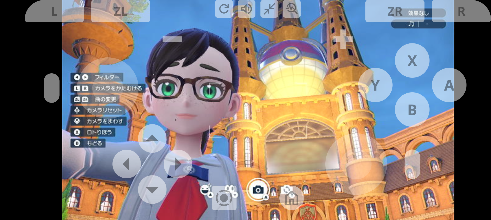

# remote-game-console

Web-based remote control system for video, audio, and game controller streaming over HTTP.

## Features

- Video streaming (MJPEG)
- Audio streaming (HTTP streaming with Web Audio API)
  - **Multi-client support**: Each client receives independent audio streams without interference
- Game controller ([NX Macro Controller](https://blog.bzl-web.com/entry/2020/01/20/165719) compatible serial commands)



## Requirements

#### Ubuntu 24.04

```bash
$ sudo apt install --yes build-essential python3-dev portaudio19-dev  # for pyaudio
```

<details>
<figure>
<figcaption>without build-essential</figcaption>

```
$ uv sync
Using CPython 3.12.3 interpreter at: /usr/bin/python3.12
Creating virtual environment at: .venv
Resolved 21 packages in 0.59ms
  × Failed to build `pyaudio==0.2.14`
  ├─▶ The build backend returned an error
  ╰─▶ Call to `setuptools.build_meta.build_wheel` failed (exit status: 1)

      [stdout]
      running bdist_wheel
      running build
      running build_py
      creating build/lib.linux-x86_64-cpython-312/pyaudio
      copying src/pyaudio/__init__.py ->
      build/lib.linux-x86_64-cpython-312/pyaudio
      running build_ext
      building 'pyaudio._portaudio' extension
      creating build/temp.linux-x86_64-cpython-312/src/pyaudio
      x86_64-linux-gnu-gcc -fno-strict-overflow -Wsign-compare
      -DNDEBUG -g -O2 -Wall -fPIC -I/usr/local/include -I/usr/include
      -I/home/mukai/.cache/uv/builds-v0/.tmpvnQdqI/include
      -I/usr/include/python3.12 -c src/pyaudio/device_api.c -o
      build/temp.linux-x86_64-cpython-312/src/pyaudio/device_api.o

      [stderr]
      /home/mukai/.cache/uv/builds-v0/.tmpvnQdqI/lib/python3.12/site-packages/setuptools/dist.py:759:
      SetuptoolsDeprecationWarning: License classifiers are deprecated.
      !!

      
      ********************************************************************************
              Please consider removing the following classifiers in favor of a
      SPDX license expression:

              License :: OSI Approved :: MIT License

              See
      https://packaging.python.org/en/latest/guides/writing-pyproject-toml/#license
      for details.
      
      ********************************************************************************

      !!
        self._finalize_license_expression()
      error: command 'x86_64-linux-gnu-gcc' failed: No such file or directory

      hint: This usually indicates a problem with the package or the build
      environment.
  help: `pyaudio` (v0.2.14) was included because `remote-game-console`
        (v0.1.0) depends on `pyaudio`
```

</figure>
<figure>
<figcaption>without python3-dev</figcaption>

```
$ uv sync
Resolved 21 packages in 0.60ms
  × Failed to build `pyaudio==0.2.14`
  ├─▶ The build backend returned an error
  ╰─▶ Call to `setuptools.build_meta.build_wheel` failed (exit status: 1)

      [stdout]
      running bdist_wheel
      running build
      running build_py
      copying src/pyaudio/__init__.py ->
      build/lib.linux-x86_64-cpython-312/pyaudio
      running build_ext
      building 'pyaudio._portaudio' extension
      x86_64-linux-gnu-gcc -fno-strict-overflow -Wsign-compare
      -DNDEBUG -g -O2 -Wall -fPIC -I/usr/local/include -I/usr/include
      -I/home/mukai/.cache/uv/builds-v0/.tmpfiz1In/include
      -I/usr/include/python3.12 -c src/pyaudio/device_api.c -o
      build/temp.linux-x86_64-cpython-312/src/pyaudio/device_api.o

      [stderr]
      /home/mukai/.cache/uv/builds-v0/.tmpfiz1In/lib/python3.12/site-packages/setuptools/dist.py:759:
      SetuptoolsDeprecationWarning: License classifiers are deprecated.
      !!

      
      ********************************************************************************
              Please consider removing the following classifiers in favor of a
      SPDX license expression:

              License :: OSI Approved :: MIT License

              See
      https://packaging.python.org/en/latest/guides/writing-pyproject-toml/#license
      for details.
      
      ********************************************************************************

      !!
        self._finalize_license_expression()
      In file included from src/pyaudio/device_api.c:1:
      src/pyaudio/device_api.h:7:10: fatal error: Python.h:
      そのようなファイルやディレクトリはありません
          7 | #include "Python.h"
            |          ^~~~~~~~~~
      compilation terminated.
      error: command '/usr/bin/x86_64-linux-gnu-gcc' failed with exit code 1

      hint: This usually indicates a problem with the package or the build
      environment.
  help: `pyaudio` (v0.2.14) was included because `remote-game-console`
        (v0.1.0) depends on `pyaudio`
```

</figure>
<figure>
<figcaption>without portaudio19-dev</figcaption>

```
$ uv sync
Resolved 21 packages in 0.70ms
  × Failed to build `pyaudio==0.2.14`
  ├─▶ The build backend returned an error
  ╰─▶ Call to `setuptools.build_meta.build_wheel` failed (exit status: 1)

      [stdout]
      running bdist_wheel
      running build
      running build_py
      copying src/pyaudio/__init__.py ->
      build/lib.linux-x86_64-cpython-312/pyaudio
      running build_ext
      building 'pyaudio._portaudio' extension
      x86_64-linux-gnu-gcc -fno-strict-overflow -Wsign-compare
      -DNDEBUG -g -O2 -Wall -fPIC -I/usr/local/include -I/usr/include
      -I/home/mukai/.cache/uv/builds-v0/.tmpR25thR/include
      -I/usr/include/python3.12 -c src/pyaudio/device_api.c -o
      build/temp.linux-x86_64-cpython-312/src/pyaudio/device_api.o

      [stderr]
      /home/mukai/.cache/uv/builds-v0/.tmpR25thR/lib/python3.12/site-packages/setuptools/dist.py:759:
      SetuptoolsDeprecationWarning: License classifiers are deprecated.
      !!

      
      ********************************************************************************
              Please consider removing the following classifiers in favor of a
      SPDX license expression:

              License :: OSI Approved :: MIT License

              See
      https://packaging.python.org/en/latest/guides/writing-pyproject-toml/#license
      for details.
      
      ********************************************************************************

      !!
        self._finalize_license_expression()
      src/pyaudio/device_api.c:9:10: fatal error: portaudio.h:
      そのようなファイルやディレクトリはありません
          9 | #include "portaudio.h"
            |          ^~~~~~~~~~~~~
      compilation terminated.
      error: command '/usr/bin/x86_64-linux-gnu-gcc' failed with exit code 1

      hint: This usually indicates a problem with the package or the build
      environment.
  help: `pyaudio` (v0.2.14) was included because `remote-game-console`
        (v0.1.0) depends on `pyaudio`
$ apt-file search include/portaudio.h
portaudio19-dev: /usr/include/portaudio.h
```

</figure>
</details>

## Installation

```bash
$ uv sync
```

## Basic Usage

```bash
uv run python -m remote_game_console \
  --video-capture 0 \
  --width 640 \
  --height 480 \
  --serial-port /dev/ttyUSB0 \
  --keep-alive-interval 30 \
  --audio-device 1 \
  --audio-rate 48000 \
  --override-aspect-ratio-width 16 \
  --override-aspect-ratio-height 9 \
  --jpeg-quality 60
```

Access the web UI at `http://localhost:8080`

## Disable Audio

To disable audio streaming, add the `noaudio=1` query parameter:

```
http://localhost:8080/?noaudio=1
```

## Audio Latency Control

Each client maintains its own audio buffer queue. The `--audio-queue-size` parameter controls the buffer size per client, while `--audio-buffer-size` and `--audio-min-buffer` control the frontend playback buffer.

#### Low Latency

```bash
uv run python -m remote_game_console \
  --audio-device 1 \
  --audio-chunk 512 \
  --audio-queue-size 4 \
  --audio-buffer-size 3 \
  --audio-min-buffer 1 \
  # ... other options
```

#### Balanced, Default

```bash
uv run python -m remote_game_console \
  --audio-device 1 \
  --audio-chunk 1024 \
  --audio-queue-size 8 \
  --audio-buffer-size 5 \
  --audio-min-buffer 2 \
  # ... other options
```

#### High Stability

```bash
uv run python -m remote_game_console \
  --audio-device 1 \
  --audio-chunk 2048 \
  --audio-queue-size 15 \
  --audio-buffer-size 10 \
  --audio-min-buffer 5 \
  # ... other options
```

## List Available Audio Devices

```bash
uv run python -c "from remote_game_console.audio import list_devices; list_devices()"
```

## Fullscreen Display on Mobile

### Android

On Android browsers, you can use a bookmarklet to enable fullscreen mode. Create a bookmark with the following JavaScript code:

```javascript
javascript:document.documentElement.requestFullscreen()
```

<details>

1. Create a new bookmark in your browser
2. Set the URL to the JavaScript code above
3. Navigate to the web UI
4. Tap the bookmark to enter fullscreen mode

</details>

The [Fullscreen API](https://developer.mozilla.org/en-US/docs/Web/API/Element/requestFullscreen) has limited support and may not work on all Android browsers.

### iOS

Due to very limited support for the Fullscreen API, there is currently no practical method to achieve fullscreen mode on iOS devices for this use case.

## Acknowledgments

- [yoannmoinet/nipplejs](https://github.com/yoannmoinet/nipplejs) by Yoann Moinet ([MIT license](remote_game_console/static/nipplejs-0.10.2/package/LICENSE))
- [Noto Sans](https://fonts.google.com/noto/specimen/Noto+Sans) ([OFL-1.1 license](remote_game_console/static/Noto_Sans/OFL.txt))
- Google Fonts Icons ([Apache-2.0 license](remote_game_console/static/icons/LICENSE-2.0.txt))
  - [Arrow Drop Up](https://fonts.google.com/icons?icon.query=arrow+&icon.size=24&icon.color=%231f1f1f&selected=Material+Symbols+Outlined:arrow_drop_up:FILL@0;wght@400;GRAD@0;opsz@24&icon.platform=web)
  - [Arrow Right](https://fonts.google.com/icons?icon.query=arrow+&icon.size=24&icon.color=%231f1f1f&selected=Material+Symbols+Outlined:arrow_right:FILL@0;wght@400;GRAD@0;opsz@24&icon.platform=web)
  - [Arrow Drop Down](https://fonts.google.com/icons?icon.query=arrow+&icon.size=24&icon.color=%231f1f1f&selected=Material+Symbols+Outlined:arrow_drop_down:FILL@0;wght@400;GRAD@0;opsz@24&icon.platform=web)
  - [Arrow Left](https://fonts.google.com/icons?icon.query=arrow+&icon.size=24&icon.color=%231f1f1f&selected=Material+Symbols+Outlined:arrow_left:FILL@0;wght@400;GRAD@0;opsz@24&icon.platform=web)
  - [Home](https://fonts.google.com/icons?icon.size=24&icon.color=%231f1f1f&selected=Material+Symbols+Outlined:home:FILL@0;wght@400;GRAD@0;opsz@24&icon.platform=web)
  - [Screen Record](https://fonts.google.com/icons?icon.query=record&icon.size=24&icon.color=%231f1f1f&selected=Material+Symbols+Outlined:screen_record:FILL@0;wght@400;GRAD@0;opsz@24&icon.platform=web)